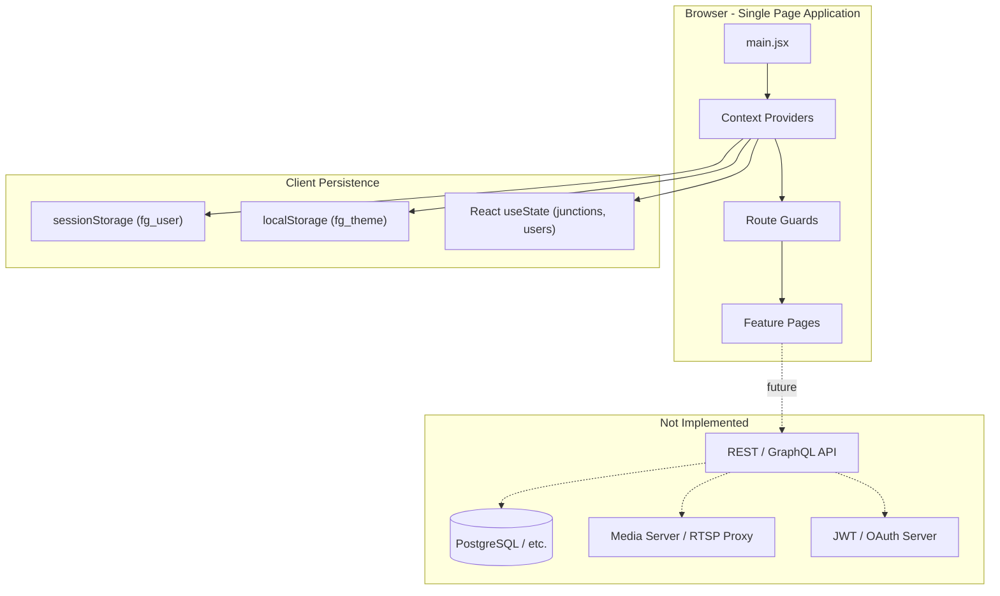
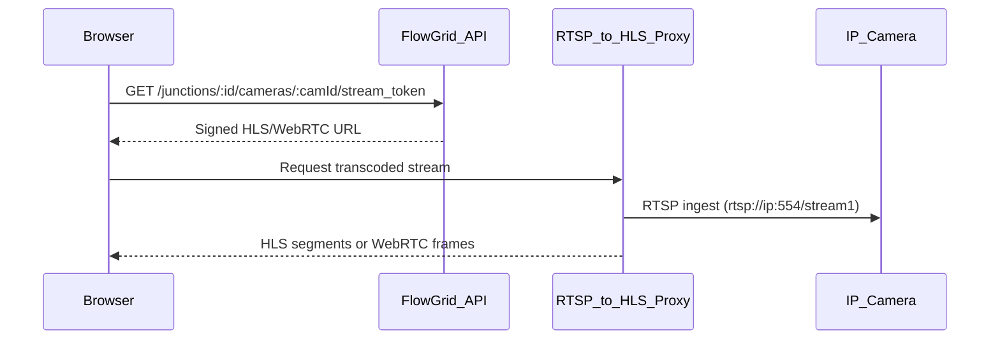

# FlowGrid Web Platform — Development Status and Architecture Report

**Report Date:** June 6, 2026  
**Repository:** `flowgrid_web`  
**Branch:** `cursor/flowgrid-saas-ui-overhaul`  
**Commits:** 2 (`7277172` initial SaaS UI, `ed9ce5f` glassmorphism + theme)

---

## Executive Summary

FlowGrid Web is a **frontend-only React SPA** that prototypes a traffic-intelligence SaaS dashboard for managing AI-controlled intersections (junctions), cameras, users, and analytics. The codebase is architecturally mature at the **UI/UX layer** — with hierarchical junction navigation, role-differentiated admin screens, simulated live metrics, and a cohesive glassmorphism design system — but it contains **no backend API, no persistent database, no real authentication, and no actual video streaming**.

| Layer | Status |
|-------|--------|
| Frontend dashboard UI | Implemented (polished prototype) |
| Backend API | Not present |
| Database / persistence | In-memory React state only |
| Authentication | Client-side demo (`sessionStorage`) |
| RBAC enforcement | UI gating only; no route or API guards |
| Video streaming | Placeholder UI; RTSP metadata unused |

**Important role naming note:** The codebase implements **Administrator** and **Operator** roles — not Admin / Technician / User as commonly described. "Technician" appears only as a **user group name** (`Field Technicians` in `src/pages/Users.jsx`), not as an auth role.

---

## 1. Core Architecture and Tech Stack

### 1.1 High-Level Architecture



The application follows a **Context-as-data-layer** pattern: three React Context providers substitute for a backend during prototyping.

### 1.2 Frontend Stack (Exact Dependencies)

From `package.json`:

| Category | Technology | Version |
|----------|-----------|---------|
| UI Framework | React | ^19.2.6 |
| Routing | react-router-dom | ^7.15.1 |
| Icons | lucide-react | ^1.16.0 |
| Charts | recharts | ^3.8.1 |
| Build Tool | Vite | ^8.0.12 |
| React Plugin | @vitejs/plugin-react | ^6.0.1 |
| Styling | Tailwind CSS | ^4.3.0 |
| Tailwind Integration | @tailwindcss/vite | ^4.3.0 |
| Linting | ESLint 10 + React Hooks plugin | ^10.3.0 |

**Not used:** TypeScript, Redux/Zustand/Jotai, React Query/TanStack Query, axios/fetch, WebSockets, HLS.js, WebRTC, video.js, JWT/OAuth libraries, form libraries, test runners.

### 1.3 Backend Stack

**None.** There is no `server/`, `api/`, `backend/`, middleware, ORM, migration layer, Docker config, or `.env` files. Vite dev server (`npm run dev`, port 5173) serves static assets only.

### 1.4 Build and Tooling

- **Entry:** `index.html` → `src/main.jsx` → `src/App.jsx`
- **Vite config:** `vite.config.js` — React + Tailwind plugins only
- **Scripts:** `dev`, `build`, `lint`, `preview`
- **Output:** Pre-built static bundle in `dist/`

### 1.5 Design System

Defined in `src/index.css`:

- CSS custom properties via Tailwind v4 `@theme` block
- Dark (default) and light themes via `data-theme` attribute on `<html>`
- Glassmorphism utilities: `.glass`, `.glass-strong`, `.glass-subtle`, `.glass-input`
- Semantic color tokens: `--color-accent` (#7c5cfc), success/danger/warning
- Inter font family, 24px card radius, animated transitions

Theme persistence via `src/ThemeContext.jsx` → `localStorage` key `fg_theme`.

### 1.6 Application Structure

```
src/
├── main.jsx              # React root + BrowserRouter
├── App.jsx               # Provider tree, routes, guards
├── AuthContext.jsx       # Demo authentication
├── JunctionContext.jsx   # Junction/camera "database"
├── ThemeContext.jsx      # Dark/light theme
├── index.css             # Design tokens + utilities
├── pages/
│   ├── Login.jsx
│   ├── JunctionSelect.jsx   # District → city/freeway → junction
│   ├── Dashboard.jsx        # Multi-camera quadrant view
│   ├── LiveStream.jsx       # Single-camera stream UI
│   ├── Devices.jsx          # Camera device management
│   ├── Users.jsx            # User/group RBAC UI
│   ├── Junctions.jsx        # Junction list + status toggle
│   └── Reports.jsx          # Analytics + incident log
└── components/
    ├── Layout.jsx, Sidebar.jsx
    ├── AddJunctionModal.jsx, JunctionCard.jsx
    ├── ProfileModal.jsx, PermissionsModal.jsx, CreateGroupModal.jsx
    ├── FlowchartModal.jsx   # Static DQN pipeline diagram
    ├── KpiCard.jsx, ChartCard.jsx, StatusPill.jsx, Toggle.jsx
    └── BackgroundDecor.jsx, ThemeToggle.jsx
```

**29 source files**, all plain JSX (no TypeScript).

---

## 2. Key Features and Implementations

### 2.1 Role-Based Access Control (RBAC)

#### What exists today

**Roles (2, not 3):**

| Role | Demo Credentials | Source |
|------|-----------------|--------|
| Administrator | `admin` / `admin123` | `src/AuthContext.jsx` |
| Operator | `operator` / `op123` | `src/AuthContext.jsx` |

**Groups (organizational, not auth roles):**

```javascript
const INITIAL_GROUPS = [
  { id: 1, name: 'Traffic Ops', color: '#7c5cfc' },
  { id: 2, name: 'Field Technicians', color: '#ec4899' },
  { id: 3, name: 'Supervisors', color: '#f59e0b' },
]
```

Users belong to groups via `groups: number[]` on each user record. Groups filter the user table but do not gate access.

#### Authentication flow

```javascript
const login = useCallback((username, password) => {
  const found = DEMO_USERS.find(u => u.username === username && u.password === password)
  if (!found) return false
  const userData = { name: found.name, role: found.role, avatar: found.avatar, username: found.username }
  setUser(userData)
  sessionStorage.setItem('fg_user', JSON.stringify(userData))
  return true
}, [])
```

- Passwords stored in plaintext in source code
- Session restored from `sessionStorage` on page load
- No tokens, refresh logic, or server validation
- Login page simulates latency with a 600ms `setTimeout` (`src/pages/Login.jsx`)

#### Route guards (auth + junction, NOT role-based)

```javascript
function ProtectedRoute({ children }) {
  const { isAuthenticated } = useAuth()
  return isAuthenticated ? children : <Navigate to="/login" replace />
}

function RequiresJunction({ children }) {
  const { hasSelectedJunction } = useJunction()
  return hasSelectedJunction ? children : <Navigate to="/select-junction" replace />
}
```

| Route | Auth | Junction | Role Check |
|-------|------|----------|------------|
| `/login` | Public | — | — |
| `/select-junction` | Yes | — | — |
| `/` (Dashboard) | Yes | Yes | No |
| `/live-stream` | Yes | Yes | No |
| `/devices` | Yes | Yes | No |
| `/users` | Yes | No | No |
| `/reports` | Yes | No | No |
| `/junctions` | Yes | No | No |

**Operators can access every route**, including user management and junction creation.

#### UI-level RBAC (Administrator-only actions)

In `src/pages/Users.jsx`: `isAdmin = currentUser?.role === 'Administrator'`

- **Admin only:** Add User, New Group, Delete Group, Permissions shield button
- **Admin or self:** Edit profile
- **Everyone:** View user table, search, filter

`src/components/PermissionsModal.jsx` defines 6 granular permissions:

```javascript
const PERMISSIONS = ['View Dashboard', 'Manage Cameras', 'Edit Junctions', 'View Reports', 'Manage Users', 'System Settings']
```

Default assignment: Administrators get all 6; Operators get first 4. **Save Permissions only closes the modal** — permissions are not persisted, not checked on routes, and not enforced on any action.

`src/components/ProfileModal.jsx` restricts role/status/employeeId/group editing to admins; username editable by admin or self.

#### RBAC gap vs. intended Admin / Technician / User model

The UI sketches a future three-tier model through groups and permissions, but the implementation maps to a simpler two-role system. A production RBAC layer would need:

- Server-side role + permission claims (JWT or session)
- Route guards (`AdminRoute`, `PermissionRoute`)
- API middleware enforcing permissions per endpoint
- Junction-scoped access (e.g., Technician limited to assigned intersections)

---

### 2.2 Intersection (Junction) Database Management

There is no SQL/NoSQL database. Junction data is managed entirely in `src/JunctionContext.jsx`.

#### Data model

**Junction (intersection):**

| Field | Type | Notes |
|-------|------|-------|
| `id` | number | Auto-increment on create |
| `name` | string | Display name |
| `district` | string | e.g. Tel Aviv, Haifa, Jerusalem |
| `city` | string \| null | null for freeways |
| `roadType` | `'urban'` \| `'freeway'` | Determines hierarchy bucket |
| `freeway` | string \| null | e.g. "Ayalon Highway (Route 20)" |
| `location` | string | GPS coordinates as text |
| `directions` | string[] | Cardinal/intercardinal directions |
| `signals` | number | Traffic signal count |
| `model` | string | DQN version (e.g. `DQN v3.2.1`) |
| `status` | `'active'` \| `'training'` | AI deployment state |
| `cameras` | Camera[] | One per direction |

**Camera (nested device):**

| Field | Type |
|-------|------|
| `id` | string (`CAM-101`) |
| `name`, `direction` | string |
| `ip`, `rtsp` | string |
| `status` | `'online'` \| `'offline'` |
| `type` | `'PTZ Camera'` \| `'Fixed Camera'` |
| `firmware` | string |

**Seed data:** 8 junctions across 3 Israeli districts, mixing urban intersections and freeway interchanges, with 2–6 cameras each.

#### Hierarchical organization (computed, not stored)

```javascript
const hierarchy = useMemo(() => {
  const districts = {}
  for (const j of junctions) {
    if (!districts[j.district]) {
      districts[j.district] = { cities: {}, freeways: {} }
    }
    if (j.roadType === 'freeway') {
      // groups under district.freeways[freewayName]
    } else {
      // groups under district.cities[cityName]
    }
  }
  return districts
}, [junctions])
```

This powers the three-level drill-down in `src/pages/JunctionSelect.jsx`: **District → City or Freeway → Junction**.

#### CRUD operations

| Operation | Function | Persistence |
|-----------|----------|-------------|
| Read | `junctions`, `activeJunction`, `hierarchy` | In-memory |
| Select | `selectJunction(id)` | In-memory (lost on refresh) |
| Create | `addJunction(junction)` | In-memory; auto-generates cameras from directions |
| Update | `updateJunction(id, updates)` | In-memory |
| Delete | — | **Not implemented** |

**Create flow:** `src/components/AddJunctionModal.jsx` — 4-step wizard (Location → Directions → Signals → AI Model) → `addJunction()` auto-provisions cameras with synthetic IPs/RTSP URLs.

**Status toggle:** `src/pages/Junctions.jsx` calls `updateJunction(id, { status })` between `active` and `training`.

#### Junction-scoped navigation

`src/components/Sidebar.jsx` disables junction-dependent nav items (Dashboard, Live Stream, Devices) with a lock icon when `hasSelectedJunction` is false. Active junction displayed in sidebar with switch/clear controls. Logout clears junction selection.

---

### 2.3 Video Streaming Routing and Logic

**No real streaming is implemented.** RTSP URLs exist as metadata on camera objects but are never consumed by a media player.

#### Client-side routing

| Route | Component | Behavior |
|-------|-----------|----------|
| `/live-stream` | `src/pages/LiveStream.jsx` | Single-camera focused view |
| `/` | `src/pages/Dashboard.jsx` | Multi-camera quadrant grid |
| `/devices` | `src/pages/Devices.jsx` | Camera metadata + config modal |

#### LiveStream logic

```javascript
const { activeJunction } = useJunction()
const cameras = activeJunction?.cameras || []
const [selected, setSelected] = useState(cameras[0]?.id)
const activeCamera = cameras.find(c => c.id === selected) || cameras[0]
```

- Camera list sourced from `activeJunction.cameras`
- `StreamCard` sidebar for camera selection
- Main viewport: gradient placeholder with text `"RTSP Stream — {camera.name}"`
- LIVE/OFFLINE badge from static `camera.status` field
- Volume, Settings, Maximize buttons have no handlers

#### Dashboard simulated metrics

```javascript
function generateMetrics(cameraId) {
  return {
    waitTime: Math.floor(Math.random() * 45) + 5,
    vehicleQueue: Math.floor(Math.random() * 30) + 1,
    lightStatus: ['Green', 'Yellow', 'Red'][Math.floor(Math.random() * 3)],
    cameraId,
    fps: Math.floor(Math.random() * 10) + 25,
  }
}
```

Metrics regenerate every 5 seconds via `setInterval`. Each camera quadrant shows a stream placeholder with random FPS.

#### Implied production streaming architecture (not built)



Browsers cannot play RTSP natively. A production system would require RTSP ingest, transcoding (FFmpeg, MediaMTX, or similar), tokenized stream URLs, and a `<video>` element or HLS.js/WebRTC client — none of which exist in this repo.

---

### 2.4 Additional Feature Areas

**Reports** (`src/pages/Reports.jsx`):
- Deterministic fake analytics via `seededRandom(junctionId)` — reproducible per junction
- Recharts: area, bar, line, pie charts
- KPI cards: vehicles, wait time, efficiency, uptime
- Incident log with severity types (Camera Offline, DQN Model Timeout, etc.)
- Junction filter dropdown; date range toggle is UI-only (does not change data)

**DQN Pipeline** (`src/components/FlowchartModal.jsx`):
- Static modal diagram of the Deep Q-Network traffic signal optimization pipeline
- Junction records track `model` version per intersection

**Device Configuration** (`src/pages/Devices.jsx`):
- Lists cameras as device cards with online/offline status
- Config modal shows editable fields; Save only closes modal (no persistence)

---

## 3. Inferred Engineering Challenges

Based on what the codebase **has solved** (UI architecture) and what it **anticipates** (domain complexity), these are the major technical challenges:

### 3.1 Challenges Addressed in Current Code

| Challenge | Solution Implemented |
|-----------|---------------------|
| Multi-junction ops UX | Hierarchical District → City/Freeway → Junction navigation with search |
| Junction-scoped workflows | Dual route guards (`ProtectedRoute` + `RequiresJunction`) + sidebar lock states |
| Urban vs. freeway topology | `roadType` discriminated union with separate hierarchy buckets |
| Variable intersection geometry | Dynamic camera provisioning from `directions[]` on junction create |
| Role-differentiated admin UI | `isAdmin` conditional rendering across Users, Profile, Permissions modals |
| Consistent design across 8 pages | Shared glassmorphism tokens, reusable components (KpiCard, StatusPill, Toggle) |
| Theme preference persistence | `ThemeContext` + `localStorage` + CSS `data-theme` switching |
| Reproducible demo analytics | Seeded PRNG in Reports avoids chart flicker on re-render |
| Live dashboard feel | 5-second metric refresh interval with per-camera randomization |

### 3.2 Challenges Anticipated but Not Yet Solved

| Challenge | Why It Is Hard | Current Gap |
|-----------|---------------|-------------|
| **Low-latency video in browser** | RTSP not browser-native; needs transcoding proxy | Placeholder UI only |
| **Secure token management** | Stream URLs must be short-lived and scoped | No JWT, no signed URLs |
| **Real RBAC enforcement** | Permissions must be server-authoritative | UI toggles only; Operators access admin routes |
| **Concurrent database access** | Multi-user junction/camera edits need transactions | Single-browser in-memory state |
| **Persistent junction selection** | Ops users expect session continuity | `activeJunctionId` lost on refresh |
| **Split user data sources** | Auth users ≠ Users page list | `AuthContext.DEMO_USERS` disconnected from `Users.jsx.INITIAL_USERS` |
| **Real-time telemetry** | DQN inference metrics need WebSocket/SSE | `Math.random()` simulation |
| **Camera fleet management** | Firmware updates, health checks, config push | Config modal is a no-op |
| **Multi-tenant junction access** | Technicians scoped to assigned intersections | No junction-user assignment model |
| **Production auth** | Password hashing, MFA, session expiry | Plaintext demo credentials in source |

---

## 4. Current State and Limitations

### 4.1 What Works Well

- **Complete navigation shell:** Login → junction selection → dashboard with sidebar, profile modal, theme toggle, logout
- **Polished visual design:** Glassmorphism, dark/light themes, traffic-themed background decor, responsive grid layouts
- **Domain model fidelity:** Junctions, cameras, DQN model versions, signal counts, and Israeli geography seed data are realistic
- **Junction creation wizard:** 4-step modal with direction picker, signal count, and AI model selection
- **User management UI:** Search, pagination, group filters, role badges, permissions modal scaffolding
- **Reports dashboard:** Rich chart suite with junction-specific seeded data and incident severity system
- **Build pipeline:** Clean Vite 8 + React 19 + Tailwind 4 setup; `dist/` output ready for static hosting

### 4.2 Critical Gaps

| Area | Severity | Detail |
|------|----------|--------|
| No backend | Critical | Entire server layer missing |
| No persistence | Critical | Junction/user changes lost on page refresh |
| No real auth | Critical | Demo credentials in source; no hashing, no tokens |
| RBAC not enforced | High | Permissions cosmetic; no route or action guards |
| No video playback | High | RTSP metadata unused |
| No API integration | High | Zero `fetch`/axios/WebSocket usage |
| Data inconsistency | Medium | Auth users and Users page list are separate datasets |
| Non-functional UI | Medium | Remember me, forgot password, device save, permissions save, date range filter |
| No junction delete | Medium | CRUD incomplete |
| No TypeScript | Low | All JSX; type safety absent |
| No tests | Low | No test runner or test files |
| Generic README | Low | Still default Vite template text |

### 4.3 Edge Cases and Known Inconsistencies

1. **Login redirect:** Successful login navigates to `/`; authenticated `/login` redirects to `/select-junction`. Both work because Dashboard requires junction, but paths differ.
2. **Junction selection on refresh:** User is authenticated but `activeJunctionId` is null → redirected to `/select-junction` every time.
3. **Profile edits:** Saving profile in Users page does not update `AuthContext` session user.
4. **Camera selection in LiveStream:** `useState(cameras[0]?.id)` does not reset when switching junctions (stale selection possible).
5. **Operator can add junctions:** No role check on `Junctions.jsx` or `AddJunctionModal`.
6. **"Technician" is not a role:** Only a group label; no distinct permissions or routing.

### 4.4 Scaling and Production Readiness

To move from prototype to production, the following layers need to be built:

1. **Backend API** (Node/Express, FastAPI, or similar) with REST endpoints for junctions, cameras, users, reports, streams
2. **Database** (PostgreSQL recommended) with proper schemas, migrations, and junction-user assignment tables
3. **Auth service** with JWT/OAuth, password hashing (bcrypt/argon2), refresh tokens, session expiry
4. **RBAC middleware** enforcing the 6 permissions defined in `PermissionsModal`
5. **Media server** (MediaMTX, Janus, or FFmpeg-based) for RTSP → HLS/WebRTC transcoding
6. **Real-time layer** (WebSocket/SSE) for live metrics from DQN inference pipeline
7. **Frontend refactor:** Replace Context mock data with API hooks (React Query), add TypeScript, add route-level permission guards

---

## 5. Development Timeline (Inferred from Git)

| Commit | Description |
|--------|-------------|
| `7277172` | Initial FlowGrid SaaS application with modern light-mode UI |
| `ed9ce5f` | Glassmorphism UI overhaul, dark/light theme toggle, traffic-themed background decor |

The project is at an **early UI prototype stage** with 2 commits on a feature branch. Engineering effort has focused on visual polish and domain UX modeling rather than backend integration.

---

## 6. Summary Assessment

FlowGrid Web is a **high-fidelity frontend prototype** that successfully models the UX complexity of a multi-junction traffic intelligence platform: hierarchical geography, junction-scoped operations, role-differentiated administration, camera fleet management, and analytics dashboards. The architectural decisions visible in the code — Context providers as a provisional data layer, dual route guards, computed hierarchy from flat junction arrays, and seeded deterministic reporting — demonstrate thoughtful frontend engineering for rapid iteration.

However, the platform described in the project brief (backend API, database schemas, streaming logic, secure RBAC) **does not yet exist in this repository**. The gap between the polished UI and a production system represents the primary body of remaining engineering work: building the full stack behind the interfaces already designed.
