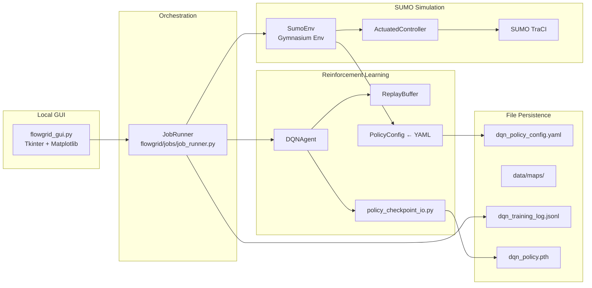

# FlowGrid — Development Status and Retrospective Report

**Project:** FlowGrid — RL-driven traffic signal control for SUMO intersections  
**Report date:** June 2026  
**Scope:** PyTorch DQN, SUMO environment, YAML policy config, local Tkinter GUI  
**Primary map:** `plan_2_opposite_thru_right` (Plan 2: opposite thru+right phasing)  
**Audience:** Academic engineering documentation draft

---

## 1. Executive Summary

FlowGrid couples a **vanilla PyTorch DQN** to a **SUMO microsimulation** through a custom **Gymnasium environment** (`SumoEnv`). A **Tkinter desktop GUI** (`gui/flowgrid_gui.py`) is the primary operator interface for map management, training, fair Compare evaluation, and reporting. Configuration is centralized in `data/defaults/dqn_policy_config.yaml` and loaded into typed Python dataclasses.

Three engineering crises shaped recent development:

1. **Decision blindness** — 20-second control steps prevented timely gap-out.
2. **Defensive gridlock** — reward shaping terrified the agent away from switching.
3. **Epsilon reset on resume** — checkpoint I/O failed to preserve exploration and cumulative training state.

The RL **infrastructure is mature** (masking, fair Compare, checkpoint resume, curriculum loop, compare guard). The **learned policy has not yet reliably beaten the fixed-time baseline** on all-vehicle wait. A fresh training era (June 2026, rebalanced rewards, 3 s steps) is in progress at episode ~111 of 500 planned.

---

## 2. Core Architecture and Tech Stack

### 2.1 High-level data flow



### 2.2 RL agent stack

| Component | Technology / implementation |
|-----------|----------------------------|
| Algorithm | Vanilla DQN (no Double/Dueling/PER) |
| Deep learning | **PyTorch ≥ 2.0** — `nn.Sequential` MLP, `optim.Adam`, `nn.MSELoss` |
| Environment API | **Gymnasium ≥ 0.29** — `SumoEnv(gym.Env)` |
| Numerics | **NumPy ≥ 1.24** |
| Configuration | **PyYAML ≥ 6.0** → `flowgrid/rl/policy_config.py` dataclasses |
| Charts | **Matplotlib ≥ 3.7** (learning curves, compare bar charts) |
| Compute | CUDA if available, else CPU |

**Network** (`flowgrid/rl/dqn_agent.py`):

```
input(26) → Linear(64) → ReLU → Linear(64) → ReLU → Linear(2)
```

**Action space (2 discrete actions):**

| ID | Meaning |
|----|---------|
| 0 | Hold current green |
| 1 | Advance to next phase in ring |

**Observation vector (26 dims on Plan 2):**

| Block | Dims | Content |
|-------|------|---------|
| Movement queues | 12 | Normalized queue length per movement (÷20) |
| Arm empty flags | 4 | Binary per arm N/S/E/W |
| Arm red-wait levels | 4 | Wait on red, normalized (÷120 s) |
| Time in phase | 1 | Normalized vs. min-green / cap |
| Emergency active | 1 | Binary |
| Transit counts | 4 | Bus/transit per arm (÷8) |

**Learning mechanics:**

- ε-greedy exploration with **per-episode** decay: `ε ← max(ε_end, ε × ε_decay)`
- Replay buffer: `deque`, capacity **10,000** transitions
- Each transition: `(state, action, reward, next_state, done, action_mask, next_action_mask)`
- Target network: hard copy every `target_update_freq` episodes (10 train / 5 resume fine-tune)
- Batch size **64**, γ **0.99**, learning rate **0.001** (0.0005 on resume)
- Invalid actions masked in Q-selection via `MASK_NEG = -1e9`

### 2.3 SUMO simulation environment

| Component | Technology / role |
|-----------|------------------|
| Simulator | **Eclipse SUMO** (external; requires `SUMO_HOME`) |
| Control API | **TraCI** (`import traci`) |
| Signal logic | `ActuatedController` — phase ring, dynamic min-green, bulk-first hold |
| Topology | `IntersectionTopology` — 4 arms, 12 movements, conflict matrix |
| Phasing | `phasing_schemes.py` — `opposite_thru_rt_then_thru` on Plan 2 |
| TLS states | `tls_builder.py` — SUMO signal string construction |
| Episode control | `EpisodeDrainTracker` — end when network clears or caps hit |

**Control timestep:** `SumoEnv.step(action)` calls `_simulate_steps(step_length)`. With `step_length: 3`, each agent decision advances SUMO **3 simulation seconds** (3 TraCI `simulationStep()` calls). `time_since_last_switch` increments once per TraCI step, so min-green and action masking operate at 1-second resolution inside each 3-second decision window.

**Operating modes:**

| Mode | Trigger | Behavior |
|------|---------|----------|
| DQN actuated | `baseline_green_seconds=None` | Agent hold/advance; controller enforces safety |
| Fixed-time baseline | `baseline_green_seconds=60` | Deterministic phase timing for Compare |
| Training | `end_when_clear=True` | Episode ends on drain or `max_sim_seconds=2400` |
| Compare | Fair replay XML | Identical vehicle departures for baseline and DQN |

### 2.4 Policy configuration (YAML)

**Master file:** `data/defaults/dqn_policy_config.yaml` (version 2)

Loaded by `PolicyConfig.load()` into structured dataclasses:

- `RewardWeights`, `ConstraintParams`, `TrainingParams`
- `EpisodeTrainingParams`, `FineTuneParams`, `PriorityServiceParams`
- Objectives block written to per-map `dqn_policy_objectives.txt` at train start

**Per-map artifacts** (`data/maps/<map_id>/`):

```
map.sumocfg, network.net.xml, routes.rou.xml
dqn_policy.pth          ← one trained network per intersection
dqn_policy_best.pth     ← best Compare snapshot (compare_guard)
.compare_cache/         ← fair-compare replay routes
```

### 2.5 Local GUI stack

| Component | Technology |
|-----------|------------|
| UI framework | **Tkinter** + `ttk` widgets |
| Plotting | **Matplotlib** with `TkAgg` backend |
| Theme | `gui/theme.py` — light palette, Segoe UI / Cascadia Mono fonts |
| Job backend | `JobRunner` — background threads, 300 ms status polling |
| Entry point | `flowgrid_gui.py` or `run_gui.bat` |

**Tabs:**

| Tab | Function |
|-----|----------|
| **Maps** | Build/select intersections via `map_registry.py` + `map_builder.py` |
| **Train** | Episode count, resume toggle (default ON), live reward chart, auto-curriculum card |
| **Compare** | Baseline vs DQN, optional SUMO 3D GUI, inject seconds, seed |
| **Reports** | Training dashboard (`training_summary.py`), compare history table |

**CLI equivalents** (for headless/Windows live output):

- `scripts/run_train.py` — `--resume`, `--fresh`, `--checkpoint-every`
- `scripts/run_compare.py` — fair Compare only
- `scripts/run_train_then_compare.py` — combined pipeline
- `scripts/run_curriculum.py` — automated train→compare cycles
- `scripts/powershell/train_and_compare.ps1` — PowerShell wrapper

**No database** — all state is filesystem JSON/YAML/XML/PTH.

---

## 3. Major Engineering Challenges and Bug Fixes

### 3.1 Decision blindness (`step_length`: 20 s → 3 s)

#### Problem

With `step_length: 20`, the DQN made one decision every **20 simulation seconds**. Dynamic minimum green could be satisfied after 5 seconds, but the agent remained blind until the next decision boundary. The **Advance** action stayed masked in `_action_mask()` because `time_since_last_switch` had not yet reached the allowed switch window from the agent's perspective.

This prevented **early gap-out**: releasing green exactly when the active queue cleared and cross-traffic was ready.

#### Mechanism (code path)

```
agent.step(action)
  → SumoEnv.step()
    → _simulate_steps(step_length)   # N × traci.simulationStep()
    → _action_mask(queues)           # uses time_since_last_switch vs min_green
```

At 20 s resolution, the agent could not react within the actuation window that human traffic engineers expect from gap-out logic.

#### Fix

| Setting | Before | After |
|---------|--------|-------|
| `training.step_length` | 20 | **3** |
| `SumoEnv` default | 5 | **3** |
| `evaluate.py` Compare | hardcoded 20 | reads `PolicyConfig.training.step_length` |
| `episode_training.max_steps` | 1500 | **1000** |

**Effect:** ~6.7× more decisions per episode (~620–766 steps at 3 s ≈ 1860–2300 s sim time before `max_sim_seconds=2400` cap).

**Objective updated** in YAML primary goal:

> *"Maximize throughput and frequent control decisions to prevent starvation and enable early gap-out."*

---

### 3.2 Defensive gridlock and reward shaping

#### Problem

The agent learned a **fear-of-switching** policy. Symptom timeline from `comparison_history.json`:

| Date | `baseline_wait_all` | `dqn_wait_all` | Failure mode |
|------|---------------------|----------------|--------------|
| 2026-05-30 | 159,015 | **56,348,773** | 411 vehicles stranded; `max_time` |
| 2026-06-01 | 159,015 | **1,892,656** | Improved vs collapse; still ~12× baseline |

Training logs showed **hold:advance ≈ 20:1** per episode. Visually, through movements starved while left phases dominated.

#### Root cause (reward imbalance)

| Term | Old | Problem |
|------|-----|---------|
| `spillback_penalty` | **-10,000** / blocked lane | One event dwarfed entire episode return |
| `throughput_per_vehicle` | **0.75** | Weak incentive to clear vehicles |
| `total_wait_scale` | **0.0001** | Insufficient steady delay pressure |
| `switch_penalty` | -1.0 | Minor additive risk aversion |

Rational policy: **never switch**, hold green, accept congestion over spillback catastrophe.

#### Fix (rebalanced `reward:` block)

| Term | Before | After |
|------|--------|-------|
| `spillback_penalty` | -10,000 | **-1,000** |
| `throughput_per_vehicle` | 0.75 | **8.0** |
| `total_wait_scale` | 0.0001 | **0.001** |

**Reward composition** (`sumo_env._compute_reward`):

```
R = spillback
  + delay_delta_scale × Δwait(all + 0.4×Δtransit + 0.35×Δemergency)
  + total_wait_scale × (−network_wait)
  + drain_bonus_per_vehicle × fleet_drop + drain_bonus_fleet_drop
  + throughput_per_vehicle × arrived_vehicles
  + fairness (imbalance, starving arms, inactive wait) [capped at fairness_cap]
  + switch_penalty + invalid_action_penalty
```

**Non-reward fixes:**

- **Left-turn gating** (`actuated_controller.py`): LEFT phase only when left queue ≥ through queue
- **Compare drain** (`dqn_drain_extra_seconds: 1500`, `stall_control_steps: 0`)
- **Catastrophic guard** (`compare_guard.py`): rollback to `dqn_policy_best.pth` when DQN wait > 2× baseline

---

### 3.3 Epsilon reset / state-loss on `--resume`

#### Problem

Resuming training caused **exploration shock** and apparent policy collapse:

1. `DQNAgent.__init__` always set `ε = epsilon_start` (**1.0**)
2. If `load_agent_checkpoint()` failed, `job_runner` **continued silently** at full exploration
3. `fine_tune.epsilon_start` (0.05) could override a trained ε (~0.01)
4. Checkpoint `episode` was **session-local** (10, 20…) not cumulative (510, 520…)
5. `steps_done`, `epsilon_decay` were not persisted
6. End-of-run saves omitted episode metadata
7. Legacy `scripts/train.py` saved **weights-only** `.pth` (no ε field)

**Documented incident:** ε jump 0.01 → 0.2 on resume correlated with ~42M training wait spike (CHANGELOG 2026-05-22).

#### Fix — checkpoint I/O rewrite

**File:** `flowgrid/rl/policy_checkpoint_io.py`

**Checkpoint payload (format v1):**

```python
{
  "format": 1,
  "policy_state": agent.policy_net.state_dict(),
  "epsilon": float,
  "episodes_done": int,       # cumulative across all sessions
  "steps_done": int,          # cumulative control steps
  "epsilon_decay": float,
  "episode": int              # legacy alias → episodes_done
}
```

**`DQNAgent` additions:**

- Counters: `episodes_done`, `steps_done`
- `export_checkpoint_meta()` / `import_checkpoint_meta()`

**`apply_resume_hyperparams()` behavior:**

- `preserve_epsilon: true` (default) → restore exact saved ε
- Restore `epsilon_decay` from checkpoint when present
- Legacy weights-only `.pth` → ε from last `dqn_training_log.jsonl` episode line

**`job_runner.py` training loop:**

- **Fail-fast:** `--resume` errors if checkpoint missing or load fails
- Increment cumulative `episodes_done`, `steps_done` each episode
- Seed offset: `episode_seed = base_seed + agent.episodes_done`
- All checkpoint saves use cumulative episode count

**Verification:** `scripts/verify_checkpoint_load.py` — eval load (ε=0) + resume round-trip.

---

### 3.4 Other significant fixes

| Issue | Solution |
|-------|----------|
| Unfair Compare | Baseline inject+drain → record departures → DQN replays identical `.rou.xml` |
| Wrong obs dims | `policy_checkpoint.quarantine_incompatible()` archives stale `.pth` |
| Windows GUI freeze | CLI scripts + `cli_poll.py` for live terminal output |
| Policy collapse | `compare_guard.py` + curriculum halt on catastrophic Compare |
| Training reset | `scripts/reset_training.py` archives to `training_archive/` |

---

## 4. Current State of the DQN Agent

### 4.1 Capabilities (what works today)

The agent **can**:

- Control a single four-way intersection via hold/advance within a constrained phase ring
- Respect action masking (min-green, bulk-first rules, illegal switch prevention)
- Train online with replay buffer on mixed episodes (40% busy snapshot + 60% fresh seeds)
- Save/resume with full exploration state (ε, episodes_done, steps_done, ε_decay)
- Be evaluated in **fair Compare** (identical traffic replay, seed 42, 800 s inject)
- Roll back to best-known checkpoint on catastrophic Compare
- Run automated curriculum (train → compare → analyze → repeat)

The agent **cannot yet**:

- Reliably beat 60 s fixed-time baseline on **all-vehicle wait** (`dqn_wait_all < baseline_wait_all`)
- Generalize across maps (one `.pth` per intersection, no transfer)
- Control right-turn lanes (free flow on separate lane by design)
- Drain heavy networks within training episode caps (most episodes end `max_time`)

### 4.2 Live training evidence (June 2026 session)

**Log:** `data/reports/dqn_training_log.jsonl`  
**Session start:** 2026-06-06, 500 episodes planned, fresh policy after reset  
**Latest logged episode:** **111** (as of report date)

| Metric | Episodes 1–111 |
|--------|----------------|
| **ε** | 1.0 → **0.573** (decay 0.995/ep) |
| **End reason** | ~100% `max_time` at 2400 s — network rarely drains in training |
| **Training `total_wait`** | ~100M–134M per episode (step-sum; not equal to Compare metric) |
| **Hold:Advance** | ~594:28 to ~732:36 (~95% hold) |
| **Throughput component** | +936 to +1560 per episode (active under new weights) |
| **Spillback component** | 0.0 throughout (penalty at -1000 rarely fires) |
| **Fairness component** | -31,050 to -36,661 per episode (dominant negative term) |
| **Checkpoint** | `dqn_policy.pth` on disk |

**Interpretation:** Still in **mid-exploration** (ε ≈ 0.57 at ep 111/500). Conservative hold-heavy behavior persists. Documentation recommends **1500–2500+ episodes** before trusting Compare on a fresh policy era.

### 4.3 Compare history (honest evaluation)

**Headline metric:** `dqn_wait_all` vs `baseline_wait_all` (all vehicles, fair replay)

| Period | Best `dqn_wait_all` | Baseline | Notes |
|--------|---------------------|----------|-------|
| May 2026 (pre-collapse) | ~169k–299k | ~159k | Near-baseline possible |
| 2026-05-30 | **56.3M** | 159k | Gridlock; 411 vehicles left |
| 2026-06-01 | **1.89M** | 159k | Bus/emergency improved; all-vehicle wait failed |
| June 2026 fresh era | *Not yet run* | — | Training in progress |

**Metric trap:** Priority wait (bus+emergency) can show +80% improvement while `wait_all` is −1090%. Always judge Compare on **`improvement_percent_all`**.

### 4.4 Struggling scenarios and edge cases

1. **Heavy-demand drain** — DQN hits `max_time` with vehicles still queued; training rarely sees `ended_reason: drained`
2. **Through starvation** — historically left-heavy phasing; controller fix helps, learning risk remains
3. **Hold-dominant Q-policy** — even with throughput=8.0, ~95% hold actions at ep 111
4. **Fairness penalty magnitude** — logged fairness ~−31k/ep may overpower local switching incentives
5. **Reward–metric gap** — shaped reward ≠ Compare cumulative wait; alignment is partial by design
6. **Busy snapshot episodes** — 40% start congested; agent may over-learn defensive holds
7. **Resume without replay buffer** — experience deque not checkpointed; resume restarts sampling pool
8. **Optimizer state** — Adam moments not saved; minor instability risk on long resume chains

### 4.5 Unfinished work

| Item | Status |
|------|--------|
| Beat baseline on `wait_all` consistently | **Not achieved** |
| Complete 500-ep fresh run + Compare | **In progress** (~111/500) |
| Cross-seed validation (42, 43, 44) | Not started |
| Replay buffer + optimizer checkpointing | Not implemented |
| Advanced RL (Double DQN, PER) | Not implemented |
| Multi-intersection / deployment pipeline | Not started |
| Doc sync (`COMPARE.md`, `DQN_HE.md` still cite 20 s step) | Pending |
| Perception / real-world integration (`perception.py`) | Prototype only |

---

## 5. Configuration Snapshot (Production)

```yaml
# Training
step_length: 3
epsilon_start: 1.0
epsilon_end: 0.01
epsilon_decay: 0.995
buffer_capacity: 10000
target_update_freq: 10

# Reward (rebalanced)
spillback_penalty: -1000
throughput_per_vehicle: 8.0
total_wait_scale: 0.001
transit_priority_scale: 0.4
emergency_priority_scale: 0.35

# Compare
inject_seconds: 800
dqn_drain_extra_seconds: 1500
stall_control_steps: 0

# Resume
fine_tune.preserve_epsilon: true
fine_tune.learning_rate: 0.0005
```

---

## 6. Key Source Files

| Path | Role |
|------|------|
| `flowgrid/rl/dqn_agent.py` | DQN network, replay, ε-greedy |
| `flowgrid/core/sumo_env.py` | Gym env, reward, masking, TraCI |
| `flowgrid/core/actuated_controller.py` | Phase ring, min-green, bulk logic |
| `flowgrid/rl/policy_checkpoint_io.py` | Checkpoint save/load, resume ε |
| `flowgrid/rl/policy_config.py` | YAML → dataclasses |
| `flowgrid/jobs/job_runner.py` | Train / compare / curriculum threads |
| `flowgrid/eval/evaluate.py` | Fair Compare pipeline |
| `flowgrid/rl/compare_guard.py` | Best-policy backup, rollback |
| `gui/flowgrid_gui.py` | Local control panel |
| `data/defaults/dqn_policy_config.yaml` | Master policy configuration |
| `scripts/run_train_then_compare.py` | Recommended workflow |

---

## 7. Recommended Next Steps

1. Finish **500-episode** fresh run; run Compare seed 42 — gate on `dqn_wait_all < baseline_wait_all`
2. If invalid, continue to **1500–2500 episodes** with `--resume`
3. Investigate **fairness penalty scale** if hold:advance stays >10:1 after ε < 0.1
4. Run Compare on seeds **43, 44** before claiming robustness
5. Sync stale docs to 3 s step_length and rebalanced reward defaults

---

*Report generated from codebase inspection and project artifacts (`dqn_training_log.jsonl`, `comparison_history.json`, `dqn_policy_config.yaml`) as of June 2026.*
