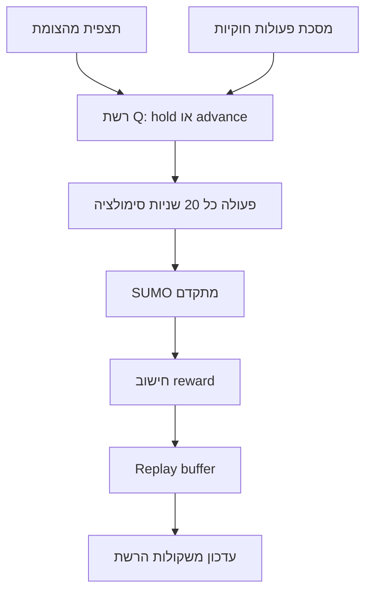

# FlowGrid — מדריך DQN בעברית

הסבר על **איך סוכן ה-DQN עובד** ו**איזו מדיניות (policy) מוגדרת לו** בפרויקט FlowGrid, לפי ההגדרות והקוד הנוכחיים (מדיניות מאוזנת — גרסה 2).

**קובץ הגדרות:** `data/defaults/dqn_policy_config.yaml`  
**משקולות שנלמדו:** `data/maps/plan_2_opposite_thru_right/dqn_policy.pth` (נוצר אחרי אימון)

---

## 1. מבוא

FlowGrid מפעיל **סוכן למידת חיזוק (DQN)** ששולט ברמזור בצומת **Plan 2** בתוך סימולציית **SUMO**.

- **באימון:** הסוכן רואה תנועה **משתנה** (seed אקראי או תמונת עומס), בוחר מתי להחזיק ירוק ומתי להחליף פאזה, ומקבל **reward** (ציון) לפי המדיניות.
- **ב-Compare:** מודדים הצלחה **הוגנת** — אותו צי רכבים ל-baseline (רמזור קבוע) ול-DQN; המדד העיקרי הוא **המתנה לכל הרכבים**.

> **חשוב:** מספר `wait` בלוג האימון **אינו** אותו מספר כמו ב-Compare. להחלטה אם המדיניות טובה — סמכו על **Compare**, לא רק על שורות האימון ב-PowerShell.

---

## 2. איך DQN עובד (מנגנון)



### רשת עצבית (Q-Network)

- קלט: וקטור תצפית (26 מספרים).
- שתי שכבות נסתרות, 64 נוירונים בכל שכבה.
- פלט: **2 ערכי Q** — Hold (0) ו-Advance (1).
- הסוכן בוחר את הפעולה עם ה-Q הגבוה יותר (בין הפעולות **המותרות**).

### ε-greedy (גילוי מול ניצול)

| שלב | ε (בערך) | משמעות |
|-----|----------|--------|
| התחלת אימון | 1.0 | כמעט הכל אקראי |
| אחרי ~500 אפיזודות | ~0.08 | בעיקר המדיניות שנלמדה |
| סוף אימון | 0.01 | כמעט תמיד לפי הרשת |

פרמטרים: `epsilon_start: 1.0`, `epsilon_end: 0.01`, `epsilon_decay: 0.995`.

### Replay buffer ולמידה

- נשמרים עד **10,000** מעברים (מצב, פעולה, reward, מצב הבא).
- בכל צעד: דגימה של **64** מעברים לעדכון המשקולות (Adam, `learning_rate: 0.001`).
- **רשת יעד (target network)** מתעדכנת כל **10** אפיזודות — יציבות בלמידה.

### צעד בקרה

כל פעולה של הסוכן מקדמת את SUMO ב-**20 שניות** סימולציה (`step_length: 20`).

---

## 3. מה הסוכן רואה (תצפית)

הסוכן מקבל **26** ערכים מנורמלים (בין 0 ל-1):

| רכיב | כמות | משמעות |
|------|------|--------|
| אורכי תור לפי תנועה | 12 | כמה רכבים ממתינים בכל נתיב תנועה (ישר / שמאלה / ימינה לכל כיוון) |
| כיוון ריק | 4 | האם N / S / E / W בלי תור |
| המתנה על אדום | 4 | רמת המתנה בכיוונים שלא בירוק |
| זמן בפאזה | 1 | כמה זמן הירוק הנוכחי פעיל |
| חירום פעיל | 1 | האם יש רכב חירום בצומת |
| אוטובוסים לפי כיוון | 4 | ספירת תחבורה ציבורית בכל זרוע |

---

## 4. מה הסוכן יכול לעשות (פעולות)

| פעולה | שם | משמעות |
|-------|-----|--------|
| **0** | Hold | להשאיר את הירוק הנוכחי |
| **1** | Advance | לעבור לפאזה הבאה (אחרי צהוב) |

**הסוכן לא בוחר איזו פאזה ספציפית** — רק "להחזיק" או "להחליף".  
**איזו פאזה נפתחת** נקבעת ב-**בקר Actuated** לפי:

- טבעת הפאזות של Plan 2
- תורים וביקוש
- אוטובוס / חירום (עדיפות בהחלפה הבאה)
- כללי מינימום ירוק ושוויון בין כיוונים

---

## 5. כללים קשיחים (לא נלמדים — מחוץ ל-RL)

אלה **חוקים בקוד**, לא משהו שהרשת "ממציאה":

### מסכת פעולות (Action masking)

- **לפני מינימום ירוק** — מותר רק **Hold** (אסור להחליף מוקדם).
- **כשהחלפה נדרשת** (ירוק ריק ותור בכיוון אחר, שמאלה ממתינה, וכו') — מותר רק **Advance**.
- פעולה לא חוקית — קנס `invalid_action_penalty` בלי שינוי פאזה.

### מינימום ירוק דינמי

- לפחות **5 שניות** (בטיחות) ועד **60 שניות** לפי מספר רכבים בירוק (`sec_per_car: 2.5`).
- הסוכן **יכול** להחזיק ירוק **אחרי** המינימום אם זה משתלם ב-reward.

### אוטובוס וחירום

- **אין** חיתוך מיידי של ירוק כשמופיע אמבולנס (`instant_emergency_preempt: false`).
- אוטובוס / חירום מקבלים **ירוק בהחלפת הפאזה הבאה**, אם לא מורעבים כיוונים אחרים עם תור כבד יותר.

### פקק (spillback)

- אם תור חוסם נתיב — קנס ענק (`spillback_penalty: -10000`) — מונע gridlock.

---

## 6. מדיניות Reward — מה הסוכן מנסה למקסם

**יעד ראשי:** להקטין **המתנה לכל הרכבים** (מכוניות, אוטובוסים, חירום).  
עדיפות **מתונה** לאוטובוס ולחירום — לא במחיר של הרס המתנה הכללית.

### סדר השפעה (מהחזק לחלש)

1. **Spillback** — למנוע פקק מלא.
2. **שינוי המתנה (delay_delta)** — כל רכב שווה; תוספת על **שינוי** ההמתנה:
   - אוטובוס: בערך **×1.4** (`transit_priority_scale: 0.4`)
   - חירום: בערך **×1.35** (`emergency_priority_scale: 0.35`)
3. **total_wait** — לחץ קבוע כשהרשת עמוסה (`total_wait_scale: 0.0001`).
4. **drain_bonus** — בונוס כשרכבים **יוצאים** מהמפה או כשמספר הרכבים הפעילים **יורד**.
5. **Throughput** — בונוס לכל רכב שסיים מסלול (`throughput_per_vehicle: 0.75`).
6. **Fairness** — איזון המתנה בין N / S / E / W (מוגבל ל-**±50** לצעד — `fairness_cap`).
7. **החלפת פאזה / פעולה לא חוקית** — קנסים קטנים.

### מה זה **לא** אומר

- אימון **לא** ממטמט ישירות את סכום ה-`wait` שמודפס בלוג — הוא ממטמט את ה-**reward** המורכב למעלה.
- Compare **כן** מודד סכום המתנה הוגן מול baseline — זה המדד לפריסה.

---

## 7. Plan 2 — איך הרמזור נראה ב-SUMO

מפת **Plan 2** (`opposite_thru_rt_then_thru`) עם **פנייה ימינה נפרדת** (`separate_right_turn: true`):

| תנועה | מתי ירוק ב-SUMO |
|--------|------------------|
| **פנייה ימינה** | **תמיד ירוק** (נתיב נפרד — לא נשלט על ידי טבעת ה-DQN) |
| **ישר (through)** | רק בפאזות THRU |
| **שמאלה** | רק בפאזות LEFT (כשתור שמאלה **גדול מ**תור ישר באותו כיוון) |

### טבעת 6 הפאזות (בסדר)

1. N+S ישר+ימין  
2. E+W ישר+ימין  
3. N+S ישר בלבד  
4. E+W ישר בלבד  
5. N+S שמאלה  
6. E+W שמאלה  

אם ב-Compare נראה "רק ימין ושמאלה ירוקים" — **ימין תמיד ירוק זה תקין**; בדקו אם **ישר** מקבל ירוק בפאזות THRU.

---

## 8. אימון מול Compare

| | **אימון (Training)** | **Compare** |
|---|----------------------|-------------|
| תנועה | seed אקראי (`42+אפיזודה`) או **busy snapshot** (~40%) | אותו צי רכבים ל-baseline ול-DQN |
| בקרה | DQN בוחר Hold/Advance | Baseline: זמן קבוע 60s/25s; DQN: אותה מדיניות |
| סיום אפיזודה | ניקוי צומת או מקסימום ~2400s | ניקוי מלא של המפה (drain) |
| מדד הצלחה | reward ↑, מגמה בלוג | **DQN wait_all ≤ baseline** |

### Compare — המדד העיקרי

- **כל הרכבים** — המדד הראשי (למשל baseline ~159k על seed 42).
- אוטובוס + חירום — משני; יכול להיראות טוב גם כשהכללי גרוע (או להיפך).

אם מופיע **INVALID COMPARE** (רכבים נשארו על המפה) — התוצאה **לא** אמינה; צריך אימון מחדש או תיקון מדיניות.

---

## 9. איך מתחילים / ממשיכים (PowerShell)

מתיקיית הפרויקט:

```powershell
cd C:\Users\Einavs_PC\Documents\TrafficProject

# אימון + Compare (מומלץ)
python scripts/run_train_then_compare.py --map plan_2_opposite_thru_right --episodes 500 --checkpoint-every 10 --compare-seed 42 --inject-seconds 800

# רק Compare (אחרי שיש dqn_policy.pth)
python scripts/run_compare.py --map plan_2_opposite_thru_right --seed 42 --inject-seconds 800

# איפוס אימון (מעביר checkpoint ולוג לארכיון)
python scripts/reset_training.py

# גיבוי לפני שינוי גדול
python scripts/backup_training.py --label before_training
```

### כמה אפיזודות?

| שלב | אפיזודות (בערך) | מה לבדוק |
|-----|------------------|----------|
| מוקדם | 500 | Compare לרוב עדיין גרוע — נורמלי |
| שימושי | 1,500–2,500 | מגמה ב-Compare, ε ≈ 0.01 |
| יציב | 3,000–5,000 | Compare על seeds 42, 43, 44 |

---

## 10. קבצים חשובים

| נתיב | תפקיד |
|------|--------|
| `data/defaults/dqn_policy_config.yaml` | reward, אילוצים, אימון, compare |
| `data/maps/.../dqn_policy.pth` | משקולות הרשת |
| `data/maps/.../dqn_policy_best.pth` | הגרסה הטובה ביותר לפי Compare (אם נשמרה) |
| `data/reports/dqn_training_log.jsonl` | שורה לכל אפיזודת אימון |
| `data/reports/comparison_history.json` | היסטוריית Compare |
| `data/reports/training_archive/` | קבצים שהועברו באיפוס |

---

## 11. מסמכים באנגלית (פירוט טכני)

- [TRAINING.md](TRAINING.md) — אימון, resume, curriculum  
- [COMPARE.md](COMPARE.md) — Compare הוגן, inject, drain  
- [DQN_PRIORITY.md](DQN_PRIORITY.md) — אוטובוס, חירום, ירוק ריק  
- [FRESH_START.md](FRESH_START.md) — התחלה מאפס אחרי שינוי מדיניות גדול  
- [CHANGELOG.md](CHANGELOG.md) — היסטוריית שינויים  

---

## סיכום במשפט אחד

**הסוכן DQN לומד מתי להחזיק ומתי להחליף ירוק** לפי תורים, המתנה ותחבורה ציבורית — **תחת חוקי בטיחות ומסכת פעולות** — כדי **להקטין המתנה לכל הרכבים** עם עדיפות מתונה לאוטובוס ולחירום; **הצלחה אמיתית נמדדת ב-Compare**, לא רק בלוג האימון.
