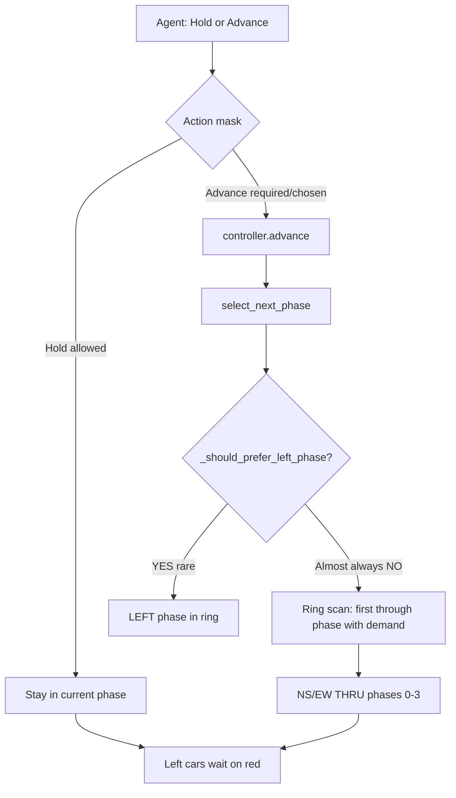

# Left-Turn Starvation — Diagnostic Report

**Project:** FlowGrid  
**Map:** `plan_2_opposite_thru_right` (`opposite_thru_rt_then_thru`, 2 lanes/approach)  
**Date:** June 2026

---

## 1. Symptom Summary

Left-turn vehicles queue on dedicated left lanes (`departLane="1"`) but dedicated **LEFT** signal phases (`NS_LEFT`, `EW_LEFT`) rarely or never activate. Training logs show **~95% Hold / ~5% Advance** actions and persistent congestion. Through movements dominate green time.

---

## 2. Plan 2 Phase Ring (Reference)

`phasing_schemes.py` builds a **6-phase ring** for `opposite_thru_rt_then_thru`:

| Index | Phase ID | Movements green |
|-------|----------|-----------------|
| 0 | `NS_THRU_RT` | N_TH, S_TH (+ right if not separate) |
| 1 | `EW_THRU_RT` | E_TH, W_TH |
| 2 | `NS_THRU` | N_TH, S_TH only |
| 3 | `EW_THRU` | E_TH, W_TH only |
| 4 | `NS_LEFT` | N_LT, S_LT |
| 5 | `EW_LEFT` | E_LT, W_LT |

LEFT phases are **last** in the ring. Reaching them requires multiple **Advance** actions while through phases ahead still show demand.

---

## 3. Root Cause Analysis

### 3.1 PRIMARY — Broken left-vs-through gating (controller + env)

**Location:** `actuated_controller._should_prefer_left_phase()`, used by:

- `phase_for_arm()` — chooses LEFT vs THRU when serving an arm
- `select_next_phase()` — ring scan for LEFT phases (lines 265–271)
- `sumo_env._left_turn_waiting_on_red()` — forces `_switch_required` (line 429)

**Logic today:**

```python
left_q = self._left_demand(queues, arm)      # N_LT sensor only
through_q = self._through_demand(queues, arm) # N_TH sensors
return left_q > self._through_demand(queues, arm)  # strict >
```

**Sensor overlap on 2-lane Plan 2** (`intersection_graph.standard_four_way()`):

| Movement | Sensor lanes |
|----------|--------------|
| `N_TH` | `n_to_center_0`, **`n_to_center_1`** |
| `N_LT` | **`n_to_center_1`** only |

Left-turn vehicles on lane 1 are counted in **both** `_left_demand` and `_through_demand`. Therefore:

- Left only, 5 cars on lane 1: `left_q = 5`, `through_q = 5` → `5 > 5` is **False**
- 1 through + 5 left: `left_q = 5`, `through_q = 6` → **False**

**`_should_prefer_left_phase` can almost never return True** when left cars exist. The system will not:

- Jump to a LEFT phase in `select_next_phase`
- Pick LEFT in `phase_for_arm`
- Set `_switch_required` via `_left_turn_waiting_on_red`

This gating was added to fix “left-only green while through starved” but it **over-corrected** and now blocks legitimate left service.

---

### 3.2 SECONDARY — Ring order + hold-heavy DQN policy

Even when Advance is legal, `select_next_phase()` walks the ring from `ring_index + 1` and returns the **first** phase with `demand >= queue_threshold` (default 1). Through phases (indices 0–3) are always checked before LEFT (4–5).

The DQN agent (~**594 hold : 28 advance** per episode in current training) predominantly chooses **Hold** when both actions are masked available. That keeps the controller on the current through phase and **does not advance the ring** toward `NS_LEFT` / `EW_LEFT`.

Advance is only forced when `_switch_required` is True (then mask = `[False, True]`). Because `_left_turn_waiting_on_red` is effectively dead (§3.1), left-specific force-switch rarely fires.

---

### 3.3 TERTIARY — Broken arm-level queue lookups in `sumo_env.py`

Two code paths use `queues.get(arm, 0)` where `arm` is `"N"`, `"S"`, etc.:

- `_green_lane_empty_other_arms_waiting()` (line 408)
- `_compute_reward()` starving term `max_red_q` (line 758)

`_read_queues()` keys are **movement IDs** (`N_LT`, `N_TH`, …), not arms. `queues.get("N", 0)` is **always 0**.

**Impact:**

- Early gap-out (“green empty, other arms waiting”) **never triggers** via this path
- Per-step starving fairness term using `max_red_q` is **inactive**

The agent loses automatic pressure to advance when red approaches have queue — including left lanes.

---

### 3.4 Bulk-hold and min-green parameters

| Parameter | Value | Effect on left |
|-----------|-------|----------------|
| `should_hold_green_for_bulk` | demand ≥ 2 on green | Extends through greens while platoons discharge |
| `switch_min_vehicles` | 3 | `should_skip_current` / preempt need 3+ on other phase |
| `min_platoon_wait_seconds` | 25 | Lone left-turn wait < 25s may not justify preempt |
| `dynamic min green` | up to 60s cap | Long hold before Advance even allowed |

These are reasonable for through but compound left starvation when combined with §3.1–3.3.

---

## 4. State Space (26-dim observation)

**Location:** `sumo_env._get_state()`

| Block | Dims | Left-turn visibility |
|-------|------|----------------------|
| Movement queues | 12 | **Yes** — each movement separately (`N_LT`, `S_LT`, `E_LT`, `W_LT` in sorted order) |
| Arm empty flags | 4 | **Partial** — arm-level only |
| Arm red-wait | 4 | **Merged** — sums all lanes on arm, not left-specific |
| Time in phase | 1 | Yes |
| Emergency flag | 1 | Yes |
| Transit per arm | 4 | Arm-level |

**Conclusion:** Left **queue lengths** are visible to the network. Left **wait time** is not isolated; it is blended into arm-level red-wait. The NN can see `N_LT` queue but the **controller hard-gates** left phases regardless of what the agent wants.

The agent cannot directly “call a left phase”; it only **Hold** or **Advance**. Advance delegates phase choice to `ActuatedController.select_next_phase()`, which applies the broken gating.

---

## 5. Action Masking

**Location:** `sumo_env._action_mask()`

| Condition | Mask | Meaning |
|-----------|------|---------|
| `_switch_required` | `[False, True]` | Must Advance |
| not `_switch_allowed` | `[True, False]` | Must Hold (min green) |
| else | `[True, True]` | Agent chooses |

**`_switch_required` triggers:**

1. `max_green` exceeded  
2. `should_skip_current` (empty current phase, other phase ≥ 3 vehicles)  
3. Min green + empty green + other arms waiting — **broken** (§3.3)  
4. Min green + `_left_turn_waiting_on_red` — **broken** (§3.1)  
5. `_should_force_switch_to_waiting` (bulk preempt rules)

**Conclusion:** Masking does **not** block Advance when left is next. It **fails to require** Advance when left is starving. When both actions are legal, the learned policy prefers Hold.

---

## 6. Reward Function

**Location:** `sumo_env._compute_reward()`

| Term | Weight | Left-turn effect |
|------|--------|------------------|
| `throughput_per_vehicle` | **8.0** | Rewards vehicles that **exit the network** — mostly cleared during through greens |
| `delay_delta` / `total_wait` | scales 1.0 / 0.001 | Penalizes all wait equally, not left-specific |
| `fairness_imbalance` | -0.1 × (max−min arm wait) | Capped ±50/step — weak vs throughput |
| `starving_arms_weight` | -0.4 | Arm starving count; `max_red_q` term **broken** (§3.3) |
| `inactive_wait_weight` | -0.05 | Only when current phase demand < threshold |
| `switch_penalty` | -1.0 | Tiny disincentive per switch |

Episode logs show `fairness ≈ -31050` (≈ 621 steps × −50 cap) vs `throughput ≈ +1000–1500` per episode. **Throughput and drain bonuses outweigh capped fairness** over an episode. The agent is not strongly incentivized to advance the ring for left service.

**Conclusion:** Reward does not specifically punish left-lane starvation. Throughput reward structurally favors keeping through greens that clear more vehicles per unit time.

---

## 7. Agent Policy Logic (End-to-End)



The agent’s effective policy is: **hold through greens long as possible**; when forced to advance, the controller **selects another through phase** before LEFT phases because of ring order and gating.

---

## 8. Parameters the Agent Relies On

From `dqn_policy_config.yaml` / GUI Train tab:

| Parameter | Default | Role |
|-----------|---------|------|
| `step_length` | 3 s | Decision interval |
| `queue_threshold` | 1 | Min demand to consider a phase |
| `switch_min_vehicles` | 3 | Min cars to justify switch |
| `switch_min_wait_seconds` | 25 | Min wait for preempt |
| `min_green_cap_seconds` | 60 | Earliest switch after min green |
| `sec_per_car` | 2.5 | Dynamic min green |
| `starving_arms_weight` | -0.4 | Fairness |
| `throughput_per_vehicle` | 8.0 | Clearing reward |

---

## 9. Fix Plan (Recommended Order)

### Step 1 — Fix left-vs-through demand comparison (critical)

In `actuated_controller.py`:

- Count **through demand only on through-exclusive lanes** (lane 0 / `sensor_lanes[0]` for TH), **not** the shared left lane; **or**
- Change condition to `left_q >= through_exclusive_q` with a small margin; **or**
- Trigger LEFT when `left_q >= threshold` **and** `left_wait >= X` seconds, independent of through comparison.

### Step 2 — Fix arm queue bugs in `sumo_env.py`

Replace `queues.get(arm, 0)` with `controller.arm_demand(queues, arm)` in:

- `_green_lane_empty_other_arms_waiting()`
- `_compute_reward()` `max_red_q` calculation

Restores gap-out and starving detection.

### Step 3 — Strengthen left phase selection in ring

Options (pick one or combine):

- When `N_LT` or `S_LT` queue ≥ threshold and wait > N seconds, **force** next phase to `NS_LEFT` if not currently in left green
- Lower `switch_min_vehicles` for left-only phases (e.g. 1–2)
- Add `_left_max_wait_seconds` constraint in YAML

### Step 4 — Observation enhancement (RL)

Add per-movement left wait (4 dims) or left-wait-on-red flags so the agent can learn left-specific urgency.

### Step 5 — Reward shaping for left service

- Per-step penalty when any `*_LT` queue > 0 and current phase does not include that movement
- Bonus for arrivals on left routes during LEFT phases
- Optional: reduce `throughput_per_vehicle` slightly; increase left-starvation penalty (uncapped or higher cap)

### Step 6 — Retrain / resume

After controller fixes, run fresh Compare (seed 42) before long retrain. Controller fixes change transition dynamics; old Q-values may be partially invalid.

---

## 10. Summary Table

| Layer | Blocks left turns? | Severity |
|-------|-------------------|----------|
| `_should_prefer_left_phase` (overlapping sensors) | **Yes — primary** | Critical |
| Ring order (LEFT last) | Yes — with hold policy | High |
| DQN hold-heavy policy | Yes — slow ring progress | High |
| `queues.get(arm)` bugs | Yes — no gap-out / starving | Medium |
| Action masking | No direct block | Low |
| Observation | Left queue visible; wait merged | Medium |
| Reward | Throughput > capped fairness | Medium |

**Exact root cause:** Left-turn phases are gated by `left_q > through_q`, but through demand **double-counts the left lane**, so the condition is almost never true. Combined with a hold-heavy agent, a through-first ring, and broken arm-queue helpers, left-turn traffic starves.

---

*Diagnostic based on `actuated_controller.py`, `phasing_schemes.py`, `sumo_env.py`, `intersection_graph.py`, `dqn_policy_config.yaml`, and `dqn_training_log.jsonl`.*
