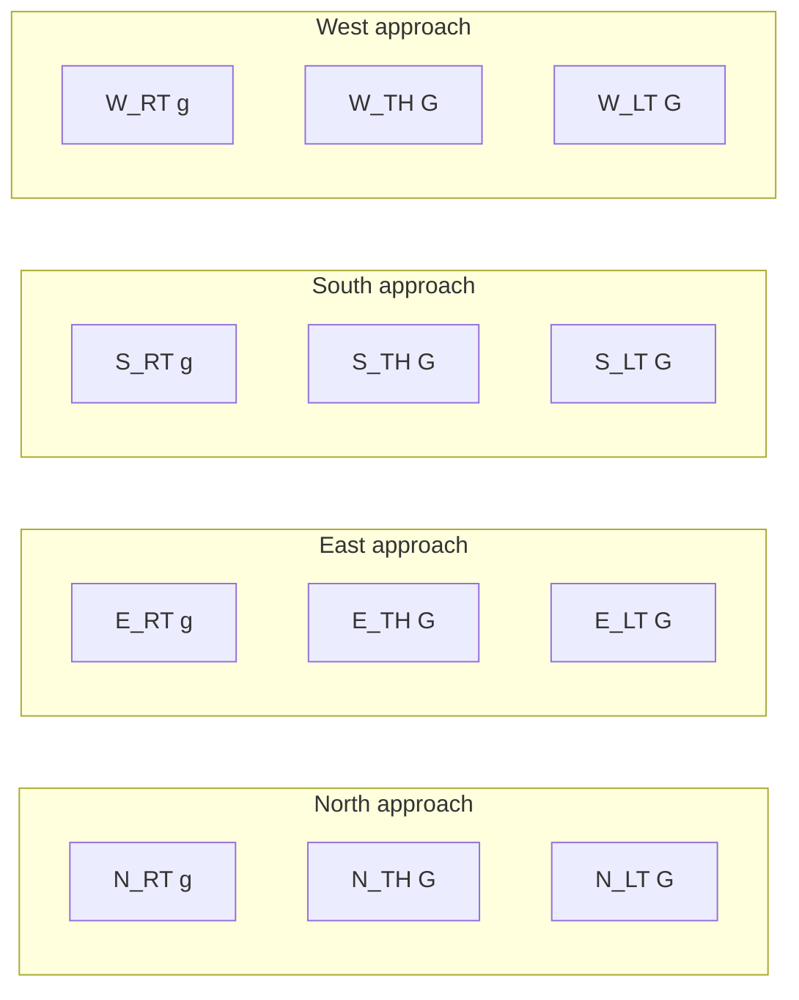
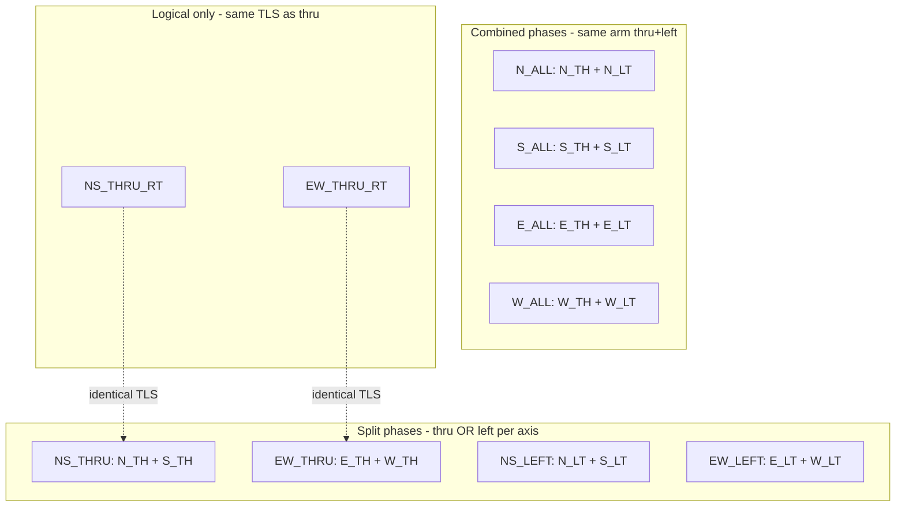

# TLS Configuration Audit (tls_config)

**Date:** 2026-05-22  
**Scope:** Default **flowgrid** map (`center` junction, 16 TLS links, 4 lanes per approach)  
**Type:** Read-only audit — no code or configuration changes

---

## Scope and sources

Primary sources:

- Static SUMO definition: [`data/maps/flowgrid/network.net.xml`](../data/maps/flowgrid/network.net.xml) (`tlLogic id="center"`)
- Runtime TLS encoding: [`flowgrid/core/tls_builder.py`](../flowgrid/core/tls_builder.py)
- Phase catalog / rings: [`flowgrid/core/phasing_schemes.py`](../flowgrid/core/phasing_schemes.py)
- Conflict / exclusivity rules: [`flowgrid/core/phase_safety.py`](../flowgrid/core/phase_safety.py), [`flowgrid/core/intersection_graph.py`](../flowgrid/core/intersection_graph.py)
- Map policy: [`data/maps/registry.json`](../data/maps/registry.json) — `phasing_scheme: opposite_thru_rt_then_thru`, `separate_right_turn: true`

At runtime, `SumoEnv` overrides static SUMO phases via `traci.trafficlight.setRedYellowGreenState("center", ...)` using strings built by `build_sixteen_lane_state()`.

---

## 16-link hardware mapping

Each approach has 4 controlled links. Right-turn links are **always permissive green** (`g`); only thru/left use protected green (`G`).

| Link index | Movement | Role in TLS string |
|------------|----------|-------------------|
| 0 | N_RT | always `g` |
| 1–2 | N_TH | `G` when phase includes N thru |
| 3 | N_LT | `G` when phase includes N left |
| 4 | E_RT | always `g` |
| 5–6 | E_TH | `G` when phase includes E thru |
| 7 | E_LT | `G` when phase includes E left |
| 8 | S_RT | always `g` |
| 9–10 | S_TH | `G` when phase includes S thru |
| 11 | S_LT | `G` when phase includes S left |
| 12 | W_RT | always `g` |
| 13–14 | W_TH | `G` when phase includes W thru |
| 15 | W_LT | `G` when phase includes W left |

---

## Layer 1: Static SUMO `tlLogic` (baseline-compatible)

[`network.net.xml`](../data/maps/flowgrid/network.net.xml) defines **4 green phases + 4 yellow clears** (8 steps total). Green states match `build_baseline_balanced_ring()`:

| Ring order (SUMO) | Phase ID | Protected movements (`G`) | TLS state (16 chars) | Default duration |
|-------------------|----------|---------------------------|----------------------|------------------|
| 0 | **NS_LEFT** | N_LT, S_LT | `grrGgrrrgrrGgrrr` | 36s |
| 1 | **NS_THRU** | N_TH, S_TH | `gGGrgrrrgGGrgrrr` | 60s |
| 2 | **EW_LEFT** | E_LT, W_LT | `grrrgrrGgrrrgrrG` | 36s |
| 3 | **EW_THRU** | E_TH, W_TH | `grrrgGGrgrrrgGGr` | 60s |

**Thru phases (opposite pairs):**

- `NS_THRU` → N_TH + S_TH
- `EW_THRU` → E_TH + W_TH

**Left phases (opposite pairs):**

- `NS_LEFT` → N_LT + S_LT
- `EW_LEFT` → E_LT + W_LT

No phase in this layer combines thru **and** left on the same arm. Thru and left are **split across separate greens**.

---

## Layer 2: Map phasing scheme (`opposite_thru_rt_then_thru`)

From [`registry.json`](../data/maps/registry.json) and [`phasing_schemes.py`](../flowgrid/core/phasing_schemes.py), the DQN/actuated **backbone ring** has **6 phases** before directional peels are appended:

| Index | Phase ID | Description | Protected movements | TLS state |
|-------|----------|-------------|---------------------|-----------|
| 0 | **NS_THRU_RT** | N+S thru + right (logical) | N_TH, S_TH (+ RT always `g`) | `gGGrgrrrgGGrgrrr` |
| 1 | **EW_THRU_RT** | E+W thru + right (logical) | E_TH, W_TH (+ RT always `g`) | `grrrgGGrgrrrgGGr` |
| 2 | **NS_THRU** | N+S thru only | N_TH, S_TH | `gGGrgrrrgGGrgrrr` |
| 3 | **EW_THRU** | E+W thru only | E_TH, W_TH | `grrrgGGrgrrrgGGr` |
| 4 | **NS_LEFT** | N+S left only | N_LT, S_LT | `grrGgrrrgrrGgrrr` |
| 5 | **EW_LEFT** | E+W left only | E_LT, W_LT | `grrrgrrGgrrrgrrG` |

**Critical hardware note:** With `separate_right_turn: true`, `_RT` movements are **not** added to the TLS string as protected greens — they are always `g`. Therefore:

- `NS_THRU_RT` and `NS_THRU` produce **identical** 16-character states
- `EW_THRU_RT` and `EW_THRU` produce **identical** 16-character states

The `_THRU_RT` phase IDs are logical distinctions only; SUMO hardware cannot distinguish them from thru-only phases in the current builder.

---

## Layer 3: Directional peel phases (combined same-arm thru+left)

When `SumoEnv` runs DQN/actuated mode on 16 links, it appends per-arm phases via `build_actuated_ring_with_directionals()` → **10 phases total**:

| Index | Phase ID | Description | Protected movements | TLS state |
|-------|----------|-------------|---------------------|-----------|
| 6 | **N_ALL** | N: left + thru together | N_LT, N_TH | `gGGGgrrrgrrrgrrr` |
| 7 | **S_ALL** | S: left + thru together | S_LT, S_TH | `grrrgrrrgGGGgrrr` |
| 8 | **E_ALL** | E: left + thru together | E_LT, E_TH | `grrrgGGGgrrrgrrr` |
| 9 | **W_ALL** | W: left + thru together | W_LT, W_TH | `grrrgrrrgrrrgGGG` |

These are the only phases that **combine thru and left on a single arm** in one green state.

**Actuated rotation (DQN):** `ActuatedController` hardcodes rotation to the 4 split phases only: `NS_THRU → NS_LEFT → EW_THRU → EW_LEFT` (`DQN_ROTATION_PHASE_IDS`). Peel phases (`*_ALL`) are optional side-trips, not part of the strict rotation cycle.

**Baseline mode:** Uses only the 4-phase balanced ring (Layer 1), not the 6+4 extended ring.

---

## Phase grouping summary

| Category | Phase IDs | Movements locked in one green |
|----------|-----------|-------------------------------|
| Opposite thru | `NS_THRU`, `NS_THRU_RT` | N_TH + S_TH |
| Opposite thru | `EW_THRU`, `EW_THRU_RT` | E_TH + W_TH |
| Opposite left | `NS_LEFT` | N_LT + S_LT |
| Opposite left | `EW_LEFT` | E_LT + W_LT |
| Same-arm combined | `N_ALL`, `S_ALL`, `E_ALL`, `W_ALL` | thru + left on one arm |

---

## Mutual exclusivity (what cannot share green)

Rules from [`phase_safety.py`](../flowgrid/core/phase_safety.py) and link foes in [`intersection_graph.py`](../flowgrid/core/intersection_graph.py):

### Strictly mutually exclusive (cannot be `G` together)

| Conflict type | Examples |
|---------------|----------|
| **Perpendicular thru** | N_TH with E_TH, W_TH, S_TH (only one axis thru at a time) |
| **Cross thru vs left** | N_TH with E_LT, S_LT, W_LT; analogous for all arms |
| **Perpendicular left vs thru** | N_LT with E_TH, S_TH, W_TH; analogous for all arms |
| **Adjacent-arm left** | N_LT with E_LT or W_LT; S_LT with E_LT or W_LT; E/W analogs |
| **NS vs EW service** | `NS_THRU` vs `EW_THRU`; `NS_LEFT` vs `EW_THRU`; `NS_THRU` vs `EW_LEFT`; etc. |

At the **phase level**, these pairs are mutually exclusive greens:

- `NS_THRU` / `NS_THRU_RT` vs `EW_THRU` / `EW_THRU_RT`
- `NS_THRU` / `NS_THRU_RT` vs `EW_LEFT`
- `NS_LEFT` vs `EW_THRU` / `EW_THRU_RT`
- `NS_LEFT` vs `EW_LEFT` (both left axes cannot run together)
- Any single `*_ALL` peel vs any phase serving a conflicting arm

### Explicitly allowed together (NOT mutually exclusive)

| Allowed pair | Where used |
|--------------|------------|
| **Same arm: thru + left** | `N_ALL`, `S_ALL`, `E_ALL`, `W_ALL` |
| **Opposite thru** | N_TH + S_TH in `NS_THRU`; E_TH + W_TH in `EW_THRU` |
| **Opposite left** | N_LT + S_LT in `NS_LEFT`; E_LT + W_LT in `EW_LEFT` |
| **Right + anything** | All `_RT` links always `g` (permissive), never conflict-gated |

Same-arm thru+left is **removed from the forbidden pair set** in `build_forbidden_protected_pairs()` (lines 75–79). Opposing left and opposing thru pairs are also whitelisted (lines 72–86).

---

## Implications for skip-logic refinement

1. **Four distinct hardware greens** for the DQN rotation: NS thru, NS left, EW thru, EW left. Skipping among these is meaningful — each changes which `G` links are active.

2. **`NS_THRU_RT` / `EW_THRU_RT` are skip duplicates** — selecting them vs `NS_THRU` / `EW_THRU` does not change lights; skip logic should treat them as equivalent hardware states.

3. **Peel phases (`*_ALL`) are true combined greens** — they unlock same-arm thru+left simultaneously. They conflict with perpendicular movements the same way a thru phase would for that arm.

4. **Baseline vs DQN ring mismatch** — baseline uses 4 phases (indices 0–3); DQN ring has 10 phases (indices 0–9) but rotation only cycles 4 IDs. Skip/tracker logic must use **phase_id**, not raw ring index, to stay consistent.

5. **No combined opposite-axis phase exists** — there is no phase that gives green to both NS thru and EW thru, or NS left and EW left, or NS thru and NS left without using a peel.

---

## Verification

Phase TLS strings were verified programmatically against `build_sixteen_lane_state()` on 2026-05-22. All states match the tables above.
